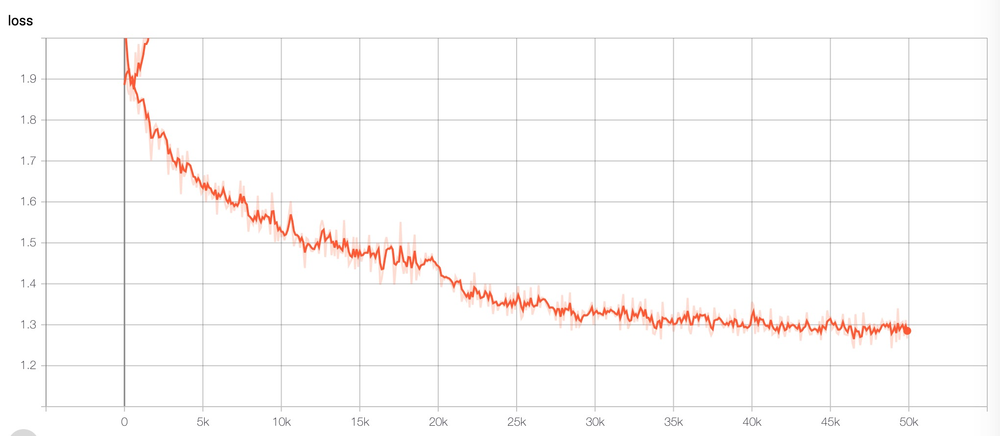
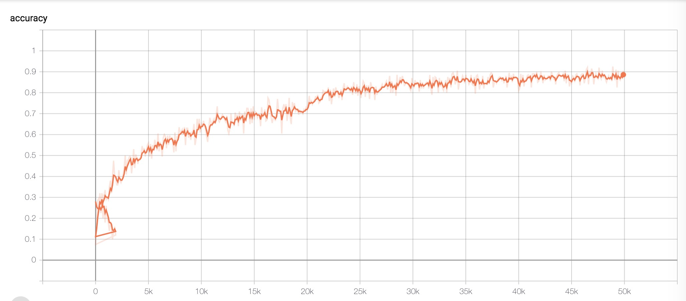
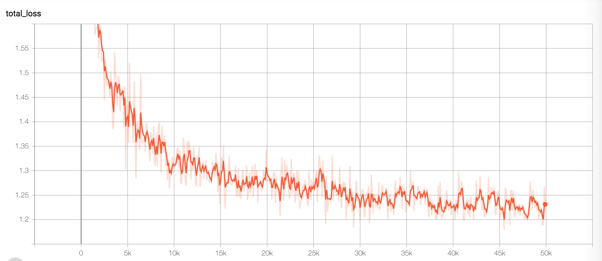
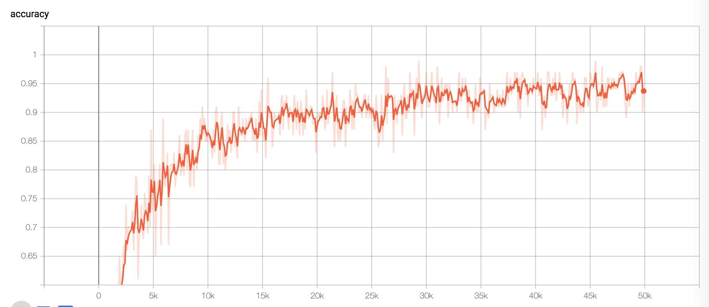
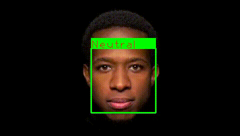
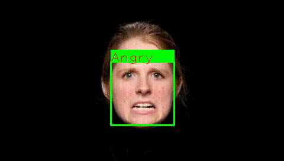
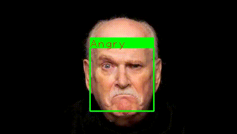
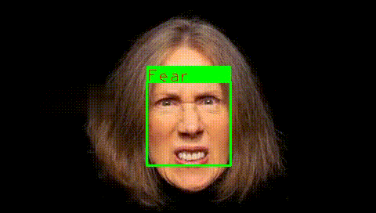

# emotion_classification
This is my personal exercises that use fer2013 datasets with Tensorflow to classify face emotion.
I used vgg and resnet respectively,but all perform poor.In the test datasets,two model achieve accuracy of 54% and 48%.

Except the reasons I do incorrectly, there are several problems with this datasets:

1. Pixel is too low
2. Have a front face, side face, cartoon face and so on. Some kinds of faces that I can't tell what.
3. Data is not a face.

The pre-trained model be put into `model/` folder.

# Below picture shows the training-process on tensorboard:
Vgg:

    
  <em> Loss </em>

    
  <em> Accuracy</em>

Resnet:

    
  <em> Loss </em>

    
  <em> Accuracy</em>

# camera/video demo:

  

  

  

  

